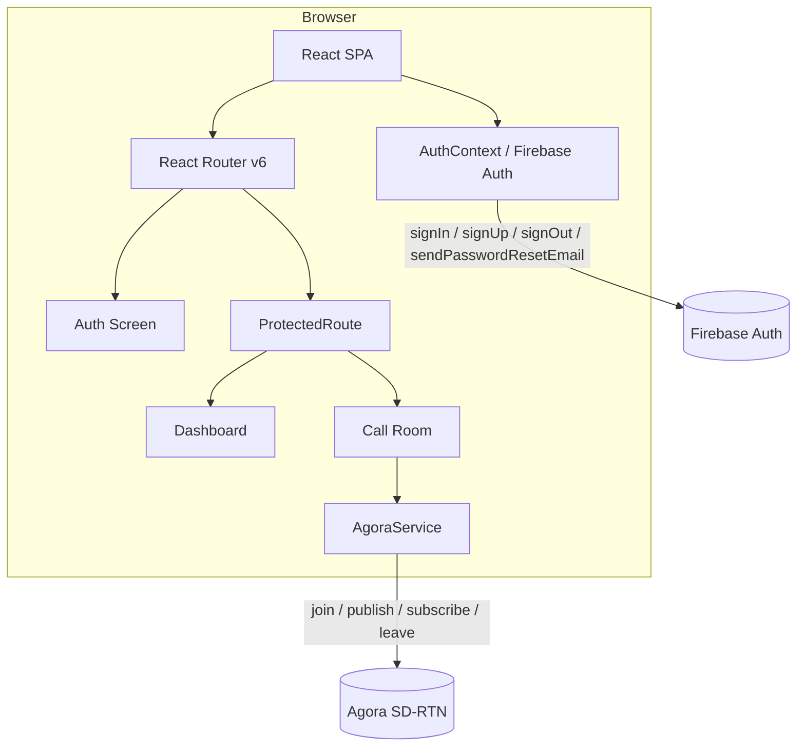

# Design Document: Vayucall App

## Overview

Vayucall is a mobile-first single-page web application (SPA) for real-time video calling. Users authenticate with email and password via Firebase Authentication, then join named video call rooms powered by the Agora Web SDK (agora-rtc-sdk-ng). The frontend is built with React.js and styled with Tailwind CSS using a deep blue and cyan/neon blue palette.

The application has three primary screens:
- **Auth Screen** — login, registration, and password reset forms
- **Dashboard** — channel name entry and logout
- **Call Room** — live video grid, local PiP overlay, and call controls

Key design decisions:
- Firebase handles all identity management (sign-up, sign-in, password reset, session persistence) so no custom auth backend is needed.
- Agora's `agora-rtc-sdk-ng` (the NG/v4 SDK) is used directly rather than the higher-level `agora-rtc-react` wrapper, giving fine-grained control over track lifecycle and event handling.
- React Context (`AuthContext`) propagates authentication state globally, enabling protected route logic without prop drilling.
- React Router v6 handles client-side routing with a `ProtectedRoute` wrapper component.

---

## Architecture



### Layers

| Layer | Responsibility |
|---|---|
| **Routing** | React Router v6 — maps URLs to screens, enforces protected routes |
| **Auth Layer** | `AuthContext` + Firebase Auth SDK — session state, sign-in/up/out, password reset |
| **Video Layer** | `AgoraService` module + Agora NG SDK — channel join/leave, track creation, publish/subscribe |
| **UI Layer** | React components + Tailwind CSS — rendering, responsive layout, user interaction |

### Route Map

| Path | Component | Protection |
|---|---|---|
| `/` | Redirects to `/auth` or `/dashboard` | — |
| `/auth` | `AuthScreen` | Redirect to `/dashboard` if authenticated |
| `/dashboard` | `Dashboard` | Redirect to `/auth` if unauthenticated |
| `/call/:channelName` | `CallRoom` | Redirect to `/auth` if unauthenticated |

---

## Components and Interfaces

### Component Tree

```
App
├── AuthContext.Provider
│   └── Router
│       ├── Route /auth → AuthScreen
│       │   ├── LoginForm
│       │   ├── RegisterForm
│       │   └── ForgotPasswordForm
│       ├── ProtectedRoute /dashboard → Dashboard
│       └── ProtectedRoute /call/:channelName → CallRoom
│           ├── RemoteVideoGrid
│           │   └── RemoteVideoTile (×N)
│           ├── LocalVideoOverlay
│           └── CallControls
```

### AuthContext

```typescript
interface AuthContextValue {
  currentUser: FirebaseUser | null;
  loading: boolean;           // true while onAuthStateChanged resolves
  login: (email: string, password: string) => Promise<UserCredential>;
  register: (email: string, password: string) => Promise<UserCredential>;
  logout: () => Promise<void>;
  sendPasswordReset: (email: string) => Promise<void>;
}
```

`AuthContext` wraps `onAuthStateChanged` in a `useEffect` and exposes the resolved user. A 10-second timeout defaults to `null` (unauthenticated) if Firebase does not respond.

### ProtectedRoute

```typescript
interface ProtectedRouteProps {
  children: ReactNode;
}
// Renders children when authenticated; redirects to /auth (with `state.from`) otherwise.
// Also redirects authenticated users away from /auth to /dashboard.
```

### AuthScreen

Manages a local `view` state: `'login' | 'register' | 'forgotPassword'`. Switching views clears all form fields. Renders the appropriate form sub-component.

### LoginForm / RegisterForm / ForgotPasswordForm

Each form manages its own field state and validation. Validation runs client-side before calling `AuthContext` methods. Displays inline error messages and a loading spinner on the submit button while a request is in progress.

### Dashboard

Reads `currentUser.email` from `AuthContext` for the greeting. Manages `channelName` input state with a 50-character max. On submit, validates non-empty/non-whitespace and navigates to `/call/:channelName`.

### CallRoom

Orchestrates the Agora session lifecycle:
1. On mount: initialise client → request permissions → create tracks → join channel → publish local tracks.
2. Subscribes to `user-published` and `user-unpublished` events to manage remote streams.
3. On unmount (or Leave button): unpublish, close tracks, leave channel.

```typescript
interface RemoteUser {
  uid: UID;
  videoTrack: IRemoteVideoTrack | null;
  audioTrack: IRemoteAudioTrack | null;
}
```

### RemoteVideoGrid

Renders a CSS grid of `RemoteVideoTile` components. Shows a "Waiting for others…" message when the remote user list is empty.

### RemoteVideoTile

Receives a `RemoteUser` object. Calls `videoTrack.play(containerRef.current)` in a `useEffect` when the track is available. Shows a "Camera Off" placeholder when `videoTrack` is null.

### LocalVideoOverlay

Calls `localVideoTrack.play(containerRef.current)` in a `useEffect`. Shows a "Camera Off" placeholder when the camera is disabled. Positioned fixed in the bottom-right corner.

### CallControls

Receives `isMuted`, `isCameraOff`, and handler callbacks as props. Renders three buttons: mute/unmute, camera on/off, leave call.

### AgoraService

A plain module (not a React component) that wraps the Agora NG SDK client lifecycle:

```typescript
interface AgoraService {
  init(appId: string): IAgoraRTCClient;
  joinChannel(
    client: IAgoraRTCClient,
    appId: string,
    channelName: string,
    token: string | null,
    uid: number | null
  ): Promise<UID>;
  createLocalTracks(): Promise<[IMicrophoneAudioTrack, ICameraVideoTrack]>;
  publishTracks(
    client: IAgoraRTCClient,
    tracks: [IMicrophoneAudioTrack, ICameraVideoTrack]
  ): Promise<void>;
  leaveChannel(
    client: IAgoraRTCClient,
    tracks: ILocalTrack[]
  ): Promise<void>;
}
```

---

## Data Models

### User (Firebase)

Firebase manages the user record. The app only reads:

```typescript
interface AppUser {
  uid: string;       // Firebase UID
  email: string;     // Used for Dashboard greeting
}
```

### Channel

Channels are ephemeral — they exist only while at least one participant is connected. No server-side channel record is stored.

```typescript
interface Channel {
  name: string;      // 1–50 characters, non-whitespace-only
}
```

### CallState (local React state in CallRoom)

```typescript
interface CallState {
  client: IAgoraRTCClient | null;
  localAudioTrack: IMicrophoneAudioTrack | null;
  localVideoTrack: ICameraVideoTrack | null;
  remoteUsers: RemoteUser[];
  isMuted: boolean;
  isCameraOff: boolean;
  isJoining: boolean;   // true while join is in progress
  error: string | null;
}
```

### Form State (per form component)

```typescript
interface LoginFormState {
  email: string;       // max 254 chars
  password: string;    // max 128 chars
  error: string | null;
  loading: boolean;
}

interface RegisterFormState {
  email: string;       // max 254 chars
  password: string;    // 6–128 chars
  error: string | null;
  loading: boolean;
}

interface ForgotPasswordFormState {
  email: string;
  error: string | null;
  success: boolean;
  loading: boolean;
}
```

### Validation Rules

| Field | Rule |
|---|---|
| Email | Contains exactly one `@`, non-empty domain, max 254 chars |
| Password (register) | 6–128 characters |
| Password (reset new) | 8–128 characters |
| Channel Name | 1–50 characters, not whitespace-only |

---

## Correctness Properties

*A property is a characteristic or behavior that should hold true across all valid executions of a system — essentially, a formal statement about what the system should do. Properties serve as the bridge between human-readable specifications and machine-verifiable correctness guarantees.*

### Property 1: Valid login inputs always attempt authentication

*For any* email string that contains exactly one `@` with a non-empty domain and is at most 254 characters, and any password between 6 and 128 characters, the login form SHALL call the Auth_Service rather than displaying a validation error.

**Validates: Requirements 2.2, 2.3**

---

### Property 2: Invalid login inputs are always rejected client-side

*For any* email that does not contain exactly one `@` with a non-empty domain, or any password shorter than 6 characters, the login form SHALL display a validation error and SHALL NOT call the Auth_Service.

**Validates: Requirements 2.2**

---

### Property 3: Registration rejects invalid inputs client-side

*For any* email that fails the format check (missing `@`, empty domain, or exceeds 254 characters), or any password outside the 6–128 character range, the registration form SHALL display a validation error and SHALL NOT call the Auth_Service.

**Validates: Requirements 1.2, 1.4, 1.5**

---

### Property 4: Channel name validation is consistent

*For any* string composed entirely of whitespace characters (spaces, tabs, newlines), the Dashboard SHALL reject it as an invalid channel name and display a validation error without navigating to the Call Room. *For any* non-empty, non-whitespace-only string of at most 50 characters, the Dashboard SHALL navigate to the Call Room for that channel name.

**Validates: Requirements 5.4, 5.5**

---

### Property 5: Form switching always clears all fields

*For any* state of the login or registration form (any combination of filled fields and error messages), switching to the other form SHALL result in all input fields being empty and all error messages being cleared.

**Validates: Requirements 2.7**

---

### Property 6: Remote user grid membership is consistent with channel events

*For any* sequence of `user-published` and `user-unpublished` Agora events with arbitrary UIDs, the set of UIDs rendered in the remote video grid SHALL equal the set of UIDs that have published but not yet unpublished.

**Validates: Requirements 8.1, 8.3**

---

### Property 7: Audio mute toggle is a round-trip

*For any* initial mute state, toggling mute SHALL change the state to its opposite and the Agora audio track's enabled state SHALL match the new UI state. Toggling a second time SHALL restore the original state.

**Validates: Requirements 9.3, 9.4**

---

### Property 8: Camera toggle is a round-trip

*For any* initial camera state, toggling the camera SHALL change the state to its opposite and the Agora video track's enabled state SHALL match the new UI state. Toggling a second time SHALL restore the original state.

**Validates: Requirements 9.5, 9.6**

---

### Property 9: Failed track toggle reverts to previous state

*For any* initial mute or camera state, if the underlying Agora track operation throws an error, the UI button state SHALL revert to the state it held before the toggle was attempted.

**Validates: Requirements 9.9**

---

### Property 10: Unauthenticated access to any protected route redirects to auth screen

*For any* protected route path (Dashboard or any Call Room path with any channel name), navigating to that path while unauthenticated SHALL redirect to the authentication screen.

**Validates: Requirements 4.1, 4.2**

---

### Property 11: Dashboard greeting always contains the user's email

*For any* valid email address belonging to the authenticated user, the Dashboard greeting SHALL contain that exact email address string.

**Validates: Requirements 5.1**

---

## Error Handling

### Authentication Errors

Firebase returns typed error codes. The app maps them to user-friendly messages:

| Firebase Error Code | User-Facing Message |
|---|---|
| `auth/email-already-in-use` | "This email is already registered." |
| `auth/invalid-email` | "Please enter a valid email address." |
| `auth/weak-password` | "Password must be at least 6 characters." |
| `auth/user-not-found` | "No account found for this email." |
| `auth/wrong-password` | "Incorrect email or password." |
| `auth/network-request-failed` | "Network error. Please check your connection." |
| `auth/expired-action-code` | "This reset link has expired or already been used." |
| Any other error | "An unexpected error occurred. Please try again." |

All auth errors are displayed inline within the form, not as modal dialogs.

### Video Call Errors

| Scenario | Handling |
|---|---|
| Camera/microphone permission denied | Display error message; provide "Return to Dashboard" button |
| Agora client init failure | Display error message; provide "Return to Dashboard" button |
| Channel join timeout (>30 s) | Display error message; provide "Return to Dashboard" button |
| Local stream publish failure | Display error message; provide "Return to Dashboard" button |
| Audio/video toggle failure | Display error message; revert button to previous state |
| Browser tab/window close | `beforeunload` event handler unpublishes tracks and leaves channel |

### Auth State Loading Timeout

`AuthContext` starts a 10-second timer when the component mounts. If `onAuthStateChanged` has not fired by then, `loading` is set to `false` and `currentUser` to `null`, causing the app to treat the session as unauthenticated.

---

## Testing Strategy

### Unit Tests (Vitest + React Testing Library)

Focus on specific examples, edge cases, and error conditions:

- **Validation logic**: Test each validation rule with boundary values (e.g., 5-char password rejected, 6-char accepted; email with/without `@`).
- **AuthContext**: Mock `onAuthStateChanged` to test loading state, authenticated state, and unauthenticated state.
- **ProtectedRoute**: Verify redirect to `/auth` for unauthenticated users and redirect to `/dashboard` for authenticated users on the auth screen.
- **Dashboard**: Verify "Join Call" button navigates with valid channel name and shows error for empty/whitespace input.
- **CallControls**: Verify button state changes on mute/unmute and camera on/off clicks.
- **Form switching**: Verify fields are cleared when toggling between login and register forms.

### Property-Based Tests (fast-check)

Each property test runs a minimum of 100 iterations. Tests are tagged with the feature and property number.

**Feature: vayucall-app**

- **Property 1 — Valid login inputs attempt authentication**: Generate valid email strings (containing `@` with non-empty domain, ≤ 254 chars) and passwords in [6, 128]; verify the form calls `AuthService.login`.
  - Tag: `Feature: vayucall-app, Property 1: Valid login inputs always attempt authentication`

- **Property 2 — Invalid login inputs rejected client-side**: Generate invalid email strings (no `@`, empty domain, etc.) and/or passwords < 6 chars; verify validation error shown and `AuthService.login` NOT called.
  - Tag: `Feature: vayucall-app, Property 2: Invalid login inputs are always rejected client-side`

- **Property 3 — Registration validation**: Generate arbitrary email and password strings; verify the form calls `AuthService.register` if and only if both pass their respective validation rules.
  - Tag: `Feature: vayucall-app, Property 3: Registration rejects invalid inputs client-side`

- **Property 4 — Channel name validation**: Generate arbitrary strings; verify whitespace-only strings are rejected and non-empty non-whitespace strings of ≤ 50 chars trigger navigation.
  - Tag: `Feature: vayucall-app, Property 4: Channel name validation is consistent`

- **Property 5 — Form switching clears fields**: Generate arbitrary form states (random field values, error messages); verify that after switching, all fields are empty strings and errors are cleared.
  - Tag: `Feature: vayucall-app, Property 5: Form switching always clears all fields`

- **Property 6 — Remote user grid consistency**: Generate arbitrary sequences of `user-published` / `user-unpublished` events with random UIDs; verify the rendered UID set matches the expected set after each event.
  - Tag: `Feature: vayucall-app, Property 6: Remote user grid membership is consistent with channel events`

- **Property 7 — Audio mute toggle round-trip**: Generate arbitrary initial mute states (boolean); verify toggle changes state and double-toggle restores original state; verify Agora track enabled state matches UI state.
  - Tag: `Feature: vayucall-app, Property 7: Audio mute toggle is a round-trip`

- **Property 8 — Camera toggle round-trip**: Generate arbitrary initial camera states (boolean); verify toggle changes state and double-toggle restores original state; verify Agora track enabled state matches UI state.
  - Tag: `Feature: vayucall-app, Property 8: Camera toggle is a round-trip`

- **Property 9 — Failed track toggle reverts state**: Generate arbitrary initial mute/camera states; mock Agora track to throw on `setEnabled`; verify UI state is unchanged after the failed toggle.
  - Tag: `Feature: vayucall-app, Property 9: Failed track toggle reverts to previous state`

- **Property 10 — Protected route redirect**: Generate arbitrary protected route paths (e.g., `/dashboard`, `/call/<random-channel-name>`); render app in unauthenticated state; verify redirect to `/auth` for all paths.
  - Tag: `Feature: vayucall-app, Property 10: Unauthenticated access to any protected route redirects to auth screen`

- **Property 11 — Dashboard greeting contains user email**: Generate arbitrary valid email strings as `currentUser.email`; render Dashboard; verify the greeting text contains the exact email string.
  - Tag: `Feature: vayucall-app, Property 11: Dashboard greeting always contains the user's email`

### Integration Tests

- **Firebase Auth integration**: Verify sign-up, sign-in, and password reset flows against the Firebase emulator.
- **Agora channel join/leave**: Verify that the Agora client joins and leaves a channel correctly using a test App ID with token disabled.
- **Protected route end-to-end**: Verify that navigating to `/dashboard` without a session redirects to `/auth`, and that after login the user is redirected back to the originally requested route.

### Responsive Layout Tests

- Verify remote video grid renders 1 column below 768 px, 2 columns at 768–1023 px, and 3+ columns at ≥ 1024 px using jsdom viewport mocking or Playwright.
- Verify local video overlay does not exceed 160×120 px on mobile and 200×150 px on desktop.
- Verify all interactive controls meet the 44×44 px minimum tap target size.
